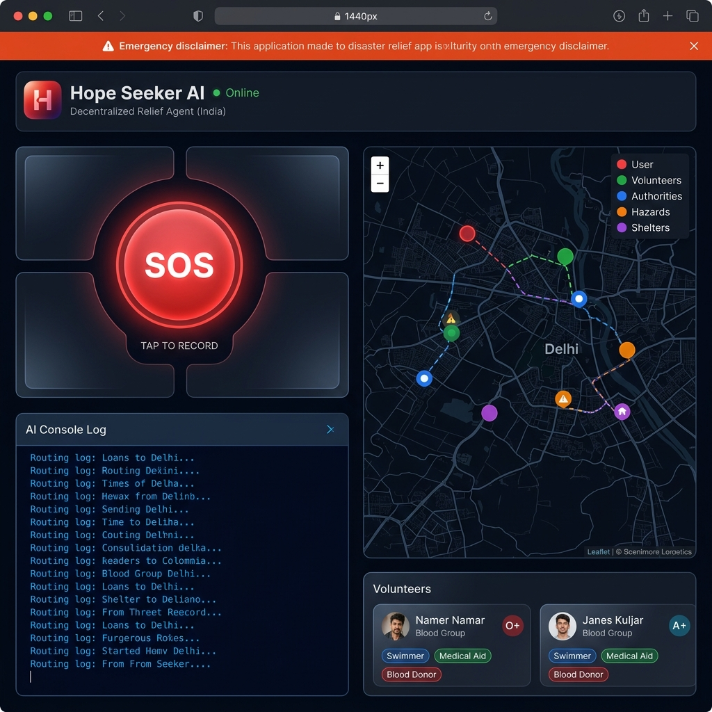
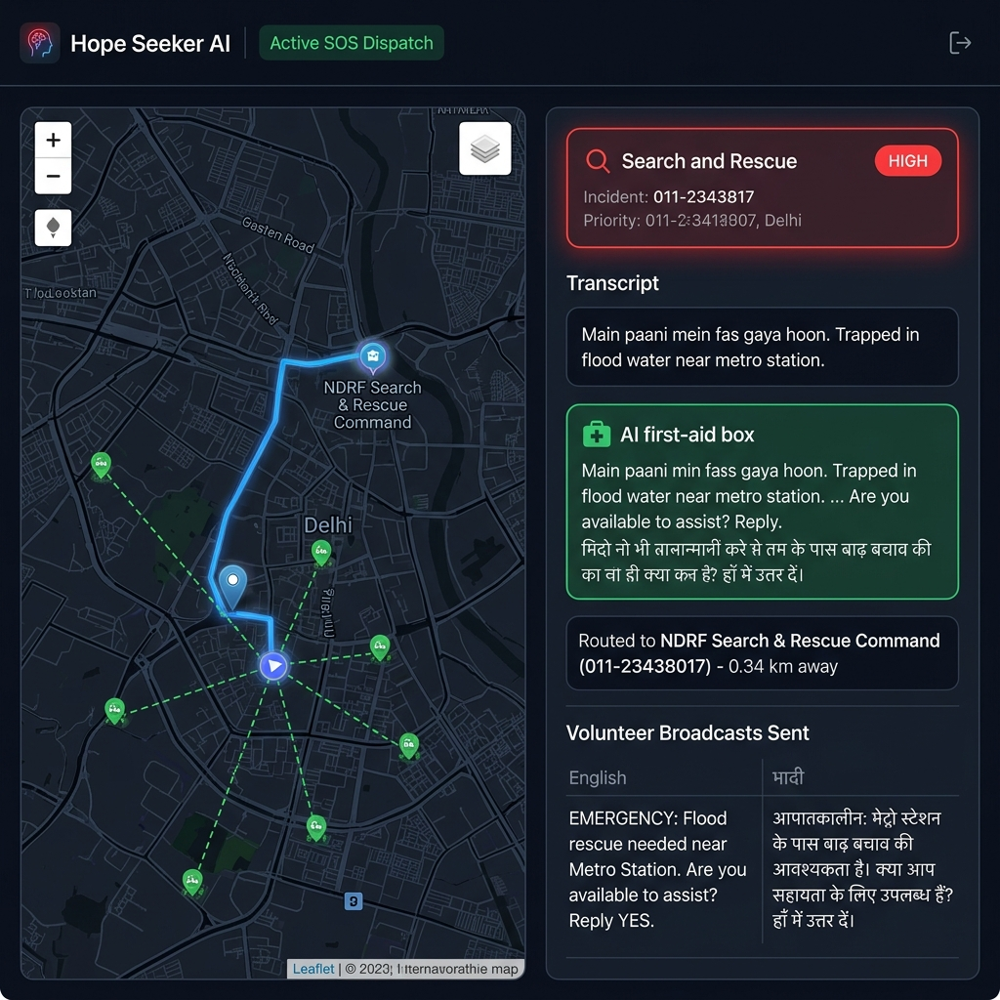
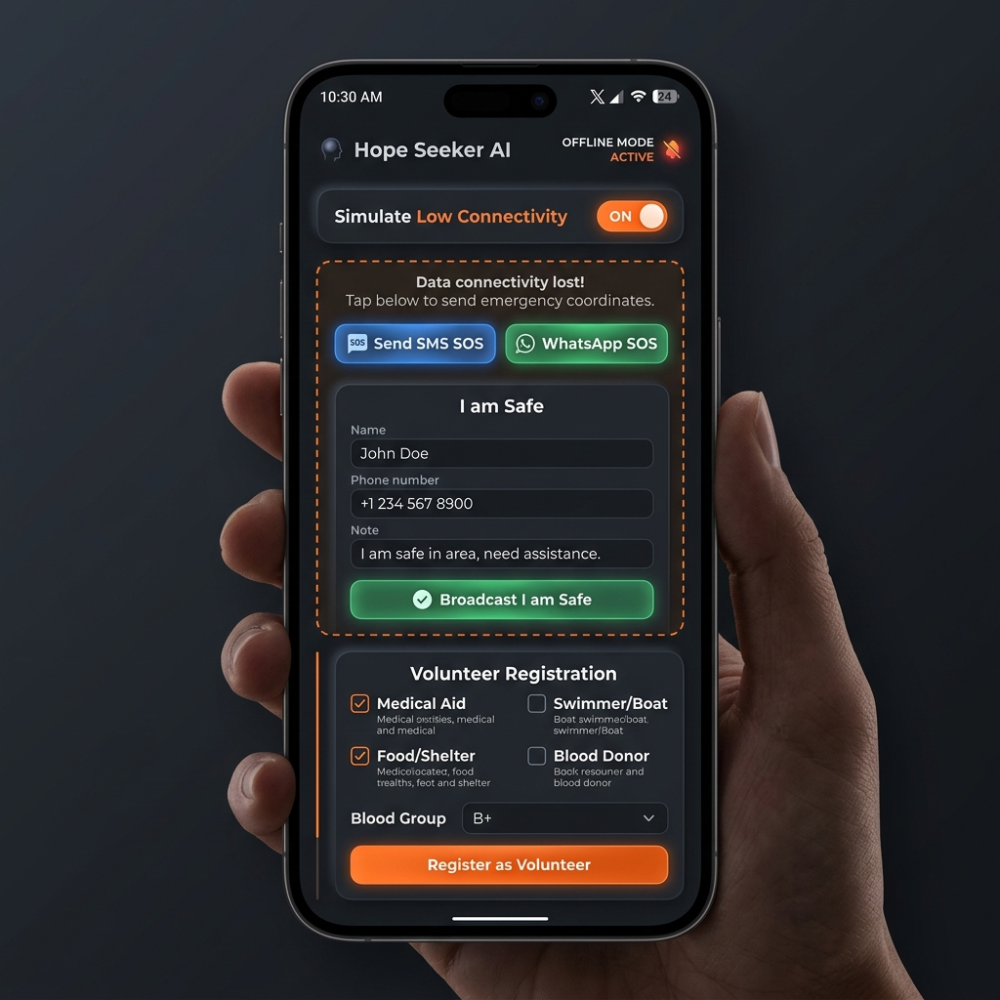

# Hope Seeker AI 🆘


**Decentralized Disaster Relief Coordination Agent — Built for India**

Hope Seeker AI is a mobile-responsive, high-contrast, accessible web application designed for rapid emergency response and community-driven disaster relief. In the event of a disaster (floods, waterlogging, earthquakes, infrastructure collapse), users can broadcast their GPS location and record an emergency voice note with a single click.

An intelligent backend coordinator powered by **Google Gemini 2.0 Flash** transcribes and classifies the distress call, routes rescue coordinates to the nearest Indian emergency authority (NDRF/SDRF command, 108 Ambulance, 101 Fire Service, or 112 ERSS), generates bilingual alert templates, and alerts volunteer swimmers, boat owners, or medics within a 2 km radius.

---

## 📸 Project Demonstration Screenshots

Here is a visual overview of the application interface, design system, and key workflows:

### 1. Main Dashboard & Spatial Coordination Map
*High-contrast glassmorphic design featuring Leaflet Dark Matter map tiles with active markers for emergency agencies, safe shelters, volunteers, and hazards.*


### 2. Live SOS Dispatch & AI First-Aid Routing Flow
*Demonstrating an active distress signal analysis: transcribing natural language, classifying the hazard, matching responders, and providing immediate bilingual first-aid advice.*


### 3. Offline Connectivity Fallback & Check-in Tools
*Ensuring resilience during cellular/data blackouts with dynamic SMS/WhatsApp fallback URL generation, family reassurance check-ins, and crowdsourced hazard reporting.*


---

## 🏗️ Architecture & Data Flow

```
┌────────────────────────────────────────────────────────────┐
│                    Web Browser (Client)                    │
│  ┌─────────────┐  ┌──────────────┐  ┌───────────────────┐ │
│  │  SOS Button │  │ Leaflet Map  │  │ MediaRecorder API │ │
│  │ + Check-in  │  │ (Dark Matter)│  │ + SpeechRecognition│ │
│  └──────┬──────┘  └──────────────┘  └─────────┬─────────┘ │
└─────────┼──────────────────────────────────────┼───────────┘
          │ POST /api/emergency                   │ Audio Blob
          ▼                                       ▼
┌─────────────────────────────────────────────────────────────┐
│                   Express Server (Node.js)                  │
│  ┌──────────────┐  ┌─────────────────┐  ┌───────────────┐  │
│  │ Gemini 2.0   │  │ Haversine Dist. │  │ In-Memory DB  │  │
│  │ Flash (AI)   │  │ Smart Routing   │  │ Volunteers    │  │
│  │ - Transcribe │  │ NDRF/108/101/112│  │ Shelters      │  │
│  │ - Classify   │  │ Bilingual Alert │  │ Hazards       │  │
│  └──────────────┘  └─────────────────┘  └───────────────┘  │
└─────────────────────────────────────────────────────────────┘
```

---

## ✨ Features

- 🆘 **One-Click SOS Action**: Concurrently captures the browser's GPS coordinates and records up to a 30-second emergency audio note.
- 🤖 **Gemini Multimodal AI**: Transcribes audio on-the-fly and runs intent analysis to categorize the emergency (Search & Rescue, Medical Aid, Hazard Report, or Basic Needs).
- 🗺️ **Interactive Spatial Map**: Real-time Leaflet.js map visualization with customizable markers showing rescue teams, active incidents, hazards, and shelters.
- 🏥 **Proximity-Based Routing**: Computes shortest-path coordinates (Haversine formula) to allocate the nearest active emergency service agency.
- 👥 **Peer-to-Peer Volunteer Matching**: Automatically identifies and targets registered local volunteers (e.g., swimmers, boat owners, medical staff) within 2 km.
- 🇮🇳 **Bilingual Alerts & First Aid**: Generates incident notifications and critical first-aid guidelines in both **English and Hindi** instantly.
- ✅ **"I am Safe" Check-In**: A quick registration portal for citizens to mark their safety status and share their location with family members.
- ⚠️ **Crowdsourced Hazard Mapping**: Allows citizens to pin community hazards (e.g., waterlogging, live wires, structural damage, road blockages) directly onto the map.
- 🏫 **Safe Shelters Directory**: Integrates a list of community shelters (e.g., Gurudwaras, NDRF camps) displaying available food, medical kits, and blankets.
- 📵 **Offline Resilience**: Detects connection loss or lets users toggle simulation mode to quickly broadcast coordinates via auto-filled SMS/WhatsApp deep links.

---

## 🛠️ Technology Stack

* **Frontend**: Vanilla HTML5, CSS3 (Modern Glassmorphic Dark Design System, custom CSS variables, responsive grid), Leaflet.js mapping, Web Geolocation API, Web MediaRecorder API, Web Speech API (transcription).
* **Backend**: Node.js, Express framework, Multer middleware (handling audio file uploads).
* **AI Orchestrator**: Google Gen AI SDK (`@google/genai` v2.10.0) calling `gemini-2.0-flash`.
* **Tests**: Custom local API health test suite (`test-api.js`) verifying mock payloads and dispatch engine mechanics.

---

## 📂 Project Directory Structure

```
hope-seeker-ai/
├── public/                 # Frontend Static Assets
│   ├── index.html          # SPA HTML Document
│   ├── style.css           # Premium Responsive CSS Design
│   └── app.js              # Leaflet Map, Speech, & API Logic
├── uploads/                # Temporary Audio Uploads Storage
├── images/                 # App Screenshot Assets for Documentation
│   ├── demo.png
│   ├── sos_flow.png
│   └── offline_mode.png
├── .env.example            # Environment Config Template
├── .gitignore              # Git Exclude Lists
├── CONTRIBUTING.md         # Open-Source Contribution Guide
├── CODE_OF_CONDUCT.md      # Community Code of Conduct
├── LICENSE                 # MIT License details
├── SECURITY.md             # Security Reporting policy
├── package.json            # Node Manifest & Dependencies
├── server.js               # Express Orchestration Engine
└── test-api.js             # Local API & Gemini Routing Tests
```

---

## 🚀 Quick Start & Installation

### Prerequisites
* [Node.js](https://nodejs.org/) v18.0.0 or higher installed.

### 1. Clone the Repository
```bash
git clone https://github.com/ujjwalraj-cds/hope-seeker-ai.git
cd hope-seeker-ai
```

### 2. Install Dependencies
```bash
npm install
```

### 3. Configure the Environment
Copy the configuration template:
```bash
cp .env.example .env
```
Open the `.env` file and insert your Gemini API Key:
```env
PORT=3000
GEMINI_API_KEY=your_gemini_api_key_here
```
> **Note**: If `GEMINI_API_KEY` is omitted, the application will transparently fall back to an in-built heuristic NLP classifier, ensuring full operational capability without internet or API dependencies.

### 4. Run the Server
```bash
node server.js
```
The server will boot up:
```
Hope Seeker AI server running at http://localhost:3000
```
Open your browser and navigate to **[http://localhost:3000](http://localhost:3000)**.

---

## 🧪 Local Testing & Verification

You can verify the backend API endpoints and Gemini routing engine locally by running the test suite:
```bash
node test-api.js
```
This tests:
1. Retrieval of available simulated volunteers, hazards, shelters, and emergency numbers.
2. Form-data submission simulating a Search and Rescue distress call.
3. Validation of emergency category classification, priority assignment, local distance calculations, volunteer alerts, and English/Hindi alert outputs.

---

## 🇮🇳 India Emergency Helpline Mappings

In actual crisis scenarios, coordinates are routed based on proximity to these central response hubs:

| Authority Agency | Contact Number | Primary Rescue Focus |
|---|---|---|
| **NDRF Rescue Command** | `011-23438017` | Major flood search, boat evacuations, urban rescue |
| **Unified Dispatch (ERSS)** | `112` | General police, emergency coordinator response |
| **Ambulance Service (EMS)** | `108` | Medical trauma, medical transports, emergency aid |
| **Fire Service Dispatch** | `101` | Structural collapse, electrical fires, industrial rescue |
| **Red Cross Coordination** | `011-23354402` | Relief supply lines, basic needs distribution |

---

## 🤝 Community & Contribution

We welcome contributions to help improve Hope Seeker AI!
* Review our [Contributing Guidelines](CONTRIBUTING.md) to get started.
* Adhere to our community standards outlined in the [Code of Conduct](CODE_OF_CONDUCT.md).
* Report security vulnerabilities responsibly as described in [SECURITY.md](SECURITY.md).

---

## ⚠️ Disclaimer

> **Hope Seeker AI is an AI-powered coordination prototype.** In life-threatening emergencies, always dial official emergency services (**112**) first.

---

## 📄 License

This project is licensed under the MIT License - see the [LICENSE](LICENSE) file for details.
