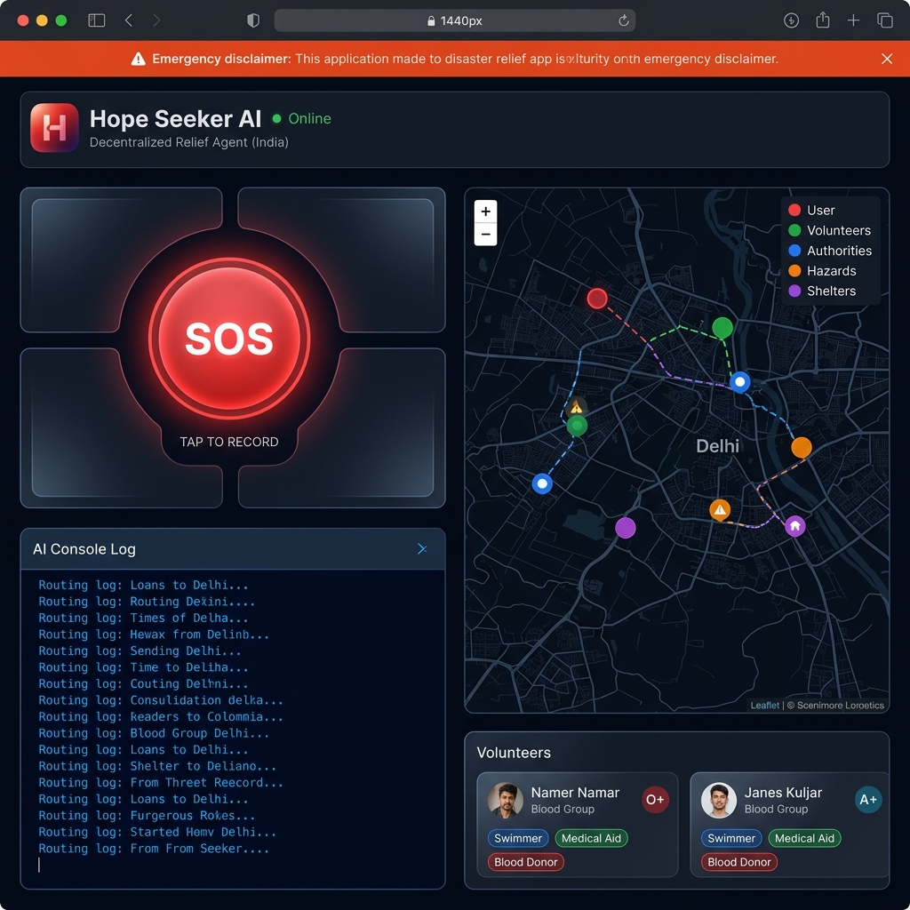
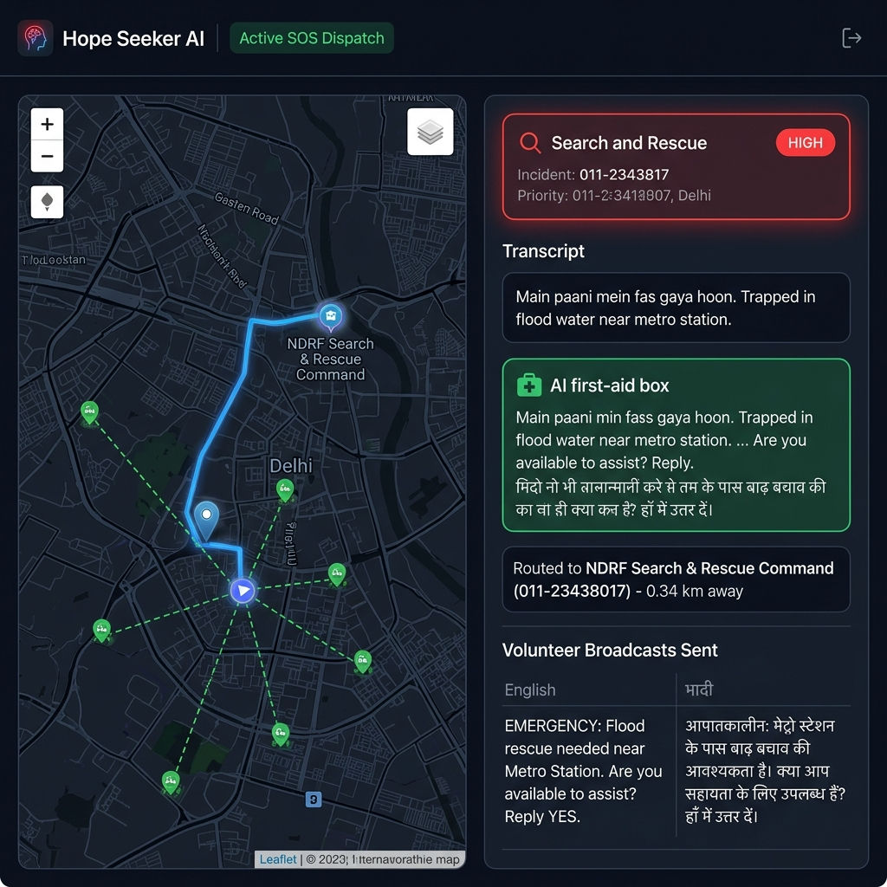
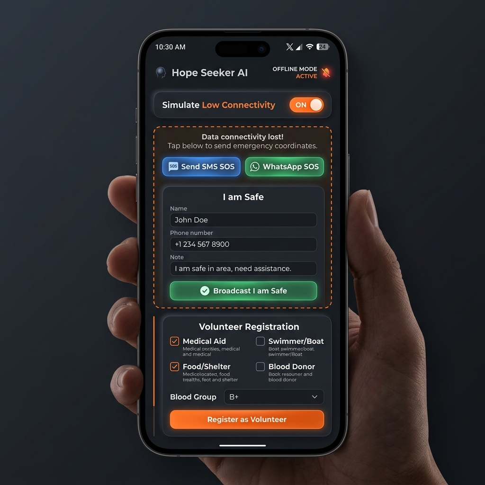

# 🆘 Hope Seeker AI

> **AI-powered disaster relief coordination platform designed to help people report emergencies, understand incidents, and connect with nearby responders faster.**

**Hope Seeker AI** is a disaster-response prototype built around a simple idea:

> **When someone needs help during a disaster, reporting the problem should be as fast and simple as possible.**

The platform combines **AI-assisted incident understanding, geolocation, proximity-based responder matching, emergency guidance, disaster mapping, and connectivity fallback mechanisms** into a single web application.

🚧 **Project Status:** Functional MVP / actively under development.

---

## 🚀 Live Demo

### Try the deployed application

**👉 [Launch Hope Seeker AI](https://hope-seeker-ai.onrender.com)**

The project is currently deployed and available as a working web application.

> **Important:** Hope Seeker AI is currently a prototype and is **not connected to official emergency dispatch infrastructure**. Responder, shelter, and emergency-service information used by the prototype may be simulated or locally defined.

---

# 📸 Project Demonstration

A visual overview of the current application and its major workflows.

## 🖥️ Main Dashboard

The main dashboard provides access to emergency reporting, location services, disaster mapping, check-ins, volunteer registration, and hazard reporting.

<p align="center">
  
</p>

---

## 🆘 SOS & AI Response Flow

The SOS workflow captures the user's location and emergency information, processes the incident, classifies the situation, and determines an appropriate response path.

<p align="center">
  
</p>

---

## 📵 Connectivity Fallback

The application includes a simulated low-connectivity mode that demonstrates fallback communication through standard SMS and WhatsApp links when normal data connectivity is unavailable.

<p align="center">
  
</p>

---

# 🎯 The Problem

During disasters such as:

* Floods
* Waterlogging
* Fires
* Earthquakes
* Structural failures
* Medical emergencies
* Infrastructure damage

people can struggle to communicate:

* **What happened**
* **Where they are**
* **What kind of help they need**
* **How urgent the situation is**
* **Who nearby can help**

Emergency information is also frequently **unstructured**. A person may simply describe what they see or hear rather than selecting from predefined categories.

Hope Seeker AI explores how AI and location-aware software can simplify the initial stage of disaster-response coordination.

---

# 💡 The Solution

Hope Seeker AI provides a unified interface where a user can submit an emergency report using information such as:

* Current location
* Voice or text description
* Emergency category
* Additional incident information

The backend then combines:

**AI analysis + geographic information + responder data + application logic**

to produce a structured response.

### High-Level Flow

```text
                    USER
                     │
          ┌──────────┼──────────┐
          │          │          │
       Location    Voice       Text
          │          │          │
          └──────────┼──────────┘
                     ▼
              Express Backend
                     │
        ┌────────────┼────────────┐
        ▼            ▼            ▼
   AI Analysis   Geospatial    Responder
                 Processing       Data
        │            │            │
        └────────────┼────────────┘
                     ▼
            Response Coordination
                     │
          ┌──────────┼──────────┐
          ▼          ▼          ▼
      Incident   Responder   Emergency
     Classification Matching   Guidance
```

---

# ✨ Key Features

## 🆘 One-Click Emergency Reporting

The SOS interface is designed to minimize the number of steps required to report an emergency.

The application can capture:

* GPS coordinates
* Emergency audio
* Incident information

The current implementation supports audio recording of up to approximately 30 seconds through the browser.

---

## 📍 GPS-Based Location

The browser's Geolocation API is used to obtain the user's current coordinates.

Location information can be used for:

* Incident mapping
* Geographic proximity calculations
* Responder matching
* Emergency context

---

## 🤖 AI-Assisted Incident Classification

The application uses **Google Gemini** to process natural-language emergency information.

The AI layer helps transform an unstructured emergency description into structured information that the application can use.

For example:

```text
User Report:

"There is a person trapped on the second floor.
The water is rising very quickly."

                    ↓

AI Analysis

Incident Type: Search & Rescue
Priority: High
Situation: Flooding
Required Response: Rescue Assistance
```

The AI layer is used as an **assistive component** and is combined with application-level logic.

---

## 🧠 Fallback Classification

The application includes a lightweight heuristic fallback mechanism.

If the external AI service is unavailable, the application can fall back to basic rule-based classification.

```text
             Emergency Report
                    │
                    ▼
             Gemini Available?
                /       \
              YES        NO
               │          │
               ▼          ▼
          Gemini AI    Heuristic
           Analysis    Classifier
               │          │
               └────┬─────┘
                    ▼
          Incident Classification
```

This reduces dependence on a single external AI service.

---

# 🗺️ Interactive Disaster Response Map

The application provides an interactive map for visualizing disaster-response information.

The current interface can display information such as:

* Emergency incidents
* Hazards
* Volunteers
* Shelters
* Emergency-service locations

The map is implemented using **Leaflet.js**.

---

# 🚑 Proximity-Based Responder Matching

The prototype uses geographic distance calculations to identify responders or response locations near an incident.

Conceptually:

```text
                    INCIDENT
                       │
        ┌──────────────┼──────────────┐
        ▼              ▼              ▼
   Responder A     Responder B     Responder C
     8.4 km          2.1 km          5.7 km
                       │
                       ▼
              Nearest Candidate
```

The prototype uses the **Haversine distance calculation** for geographic proximity.

> This is a proximity-based prototype and does not represent actual road travel time or official dispatch routing.

---

# 👥 Volunteer Coordination

The application includes a simulated community-volunteer system.

Volunteers can be registered with skills such as:

* Medical Aid
* Swimmer / Boat
* Food / Shelter
* Blood Donor

The system can then use location and volunteer information when determining potential nearby assistance.

The deployed application currently provides a simulated volunteer registration workflow.

---

# 🏫 Shelter & Resource Information

The application includes a shelter/resource directory designed to provide information about available safe locations and amenities.

The current prototype includes locally defined/simulated shelter information.

---

# ⚠️ Crowdsourced Hazard Reporting

Users can report hazards at their current coordinates.

Examples include:

* Waterlogging
* Live wires
* Structural damage
* Road blockages
* Other local hazards

These reports can then be represented on the disaster-response map.

---

# ✅ "I Am Safe" Check-In

The platform includes a safety check-in mechanism that allows users to communicate that they are safe.

The current prototype supports:

* Name
* Phone number
* Short safety message
* Location context

This is intended as a community reassurance mechanism rather than an official emergency-status system.

---

# 📵 Connectivity Fallback

Disasters can cause network congestion or connectivity loss.

Hope Seeker AI includes a **connectivity fallback simulation** that can generate emergency SMS/WhatsApp actions containing relevant emergency information.

```text
Normal Connectivity
       │
       ▼
   Web Application
       │
       │
       ▼
Connection Lost
       │
       ▼
SMS / WhatsApp Fallback
```

The deployed application currently includes a low-connectivity simulation and fallback links.

> **Note:** This should not be confused with a fully offline AI system. Full offline-first operation and local AI inference are planned areas of future development.

---

# 🌐 Bilingual Emergency Guidance

The system is designed to support emergency communication in:

* 🇬🇧 English
* 🇮🇳 Hindi

The goal is to make emergency information more accessible to users who may prefer different languages.

---

# 🛟 Emergency & First-Aid Guidance

The system can generate contextual emergency guidance based on the reported situation.

Potential scenarios include:

* Flooding
* Fire
* Medical emergencies
* Evacuation
* Immediate personal safety

> This information is intended as general guidance and **does not replace professional medical or emergency services**.

---

# 🏗️ System Architecture

```text
┌──────────────────────────────────────────────────────────┐
│                     WEB CLIENT                           │
│                                                          │
│   SOS     GPS     Voice     Maps     Check-in     UI     │
└────────────────────────┬─────────────────────────────────┘
                         │
                         │ HTTP / API
                         ▼
┌──────────────────────────────────────────────────────────┐
│                   NODE.JS + EXPRESS                      │
│                                                          │
│  API Routes • Validation • Routing • Response Logic      │
└───────────────┬──────────────────┬───────────────────────┘
                │                  │
                ▼                  ▼
       ┌────────────────┐   ┌─────────────────┐
       │  Google Gemini │   │ Geospatial      │
       │      AI        │   │ Processing      │
       │                │   │                 │
       │ Classification │   │ Haversine       │
       │ Analysis       │   │ Distance        │
       └───────┬────────┘   └────────┬────────┘
               │                     │
               └──────────┬──────────┘
                          ▼
                ┌─────────────────────┐
                │ Application Data    │
                │                     │
                │ Volunteers          │
                │ Shelters            │
                │ Hazards             │
                │ Incidents           │
                └──────────┬──────────┘
                           ▼
                ┌─────────────────────┐
                │ Response Engine     │
                │                     │
                │ Classification      │
                │ Matching            │
                │ Alerts              │
                │ Guidance            │
                └─────────────────────┘
```

---

# 🧠 Engineering Decisions

## Why Gemini?

Emergency reports are often unstructured.

Instead of requiring users to complete multiple forms, natural-language processing can help extract useful information from descriptions.

---

## Why Geographic Distance?

Emergency response is inherently location-dependent.

A nearby suitable responder can potentially be more useful than a distant responder with the same general capability.

The prototype therefore combines incident information with geographic proximity.

---

## Why Haversine Distance?

The Haversine formula provides a lightweight method for calculating approximate great-circle distance between two geographic coordinates.

It is suitable for the current prototype because it requires no external routing service.

For a production implementation, actual road-network routing and travel-time estimation would be more appropriate.

---

## Why a Fallback Classifier?

External AI services can fail because of:

* Network problems
* API failures
* Rate limits
* Configuration issues
* Service availability

A fallback classifier allows the core prototype workflow to continue functioning.

---

## Why a Lightweight Frontend?

The application uses standard browser technologies to keep the client lightweight while still accessing capabilities such as:

* Geolocation
* Audio recording
* Speech APIs
* Interactive maps

---

# 🛠️ Technology Stack

## Frontend

* HTML5
* CSS3
* Vanilla JavaScript
* Leaflet.js
* Web Geolocation API
* MediaRecorder API
* Web Speech API

## Backend

* Node.js
* Express.js
* Multer

## AI

* Google Gemini
* `@google/genai`

## Maps

* Leaflet.js
* OpenStreetMap-based map data

## Deployment

* Render

## Testing

* Node.js
* Custom API test suite

The current repository uses Node.js/Express, Leaflet, browser APIs, Multer, and Google's Gen AI SDK.

---

# 📂 Project Structure

```text
hope-seeker-ai/
│
├── public/
│   ├── index.html
│   ├── style.css
│   └── app.js
│
├── images/
│   ├── demo.png
│   ├── sos_flow.png
│   └── offline_mode.png
│
├── uploads/
│
├── .env.example
├── .gitignore
├── CONTRIBUTING.md
├── CODE_OF_CONDUCT.md
├── LICENSE
├── SECURITY.md
├── package.json
├── package-lock.json
├── server.js
├── test-api.js
└── README.md
```

---

# ⚙️ Getting Started

## Prerequisites

Install:

* **Node.js v18+**
* **npm**
* Google Gemini API key

---

## 1. Clone the Repository

```bash
git clone https://github.com/ujjwalraj-cds/hope-seeker-ai.git
cd hope-seeker-ai
```

---

## 2. Install Dependencies

```bash
npm install
```

---

## 3. Configure Environment Variables

Copy the example environment file:

```bash
cp .env.example .env
```

Then configure:

```env
PORT=3000
GEMINI_API_KEY=your_gemini_api_key_here
```

**Never commit your real API key to GitHub.**

---

## 4. Run the Application

```bash
node server.js
```

The application should then be available at:

```text
http://localhost:3000
```

---

# 🧪 Testing

The project includes a custom API test suite for verifying backend behaviour.

Run:

```bash
node test-api.js
```

The tests cover areas including:

1. API availability
2. Simulated volunteer retrieval
3. Hazard and shelter retrieval
4. Emergency form submission
5. Incident classification
6. Priority assignment
7. Geographic distance calculations
8. Volunteer matching
9. English/Hindi alert generation

---

# ⚠️ Current Limitations

Hope Seeker AI is currently a **functional prototype/MVP**.

It should **not** be considered a production emergency-response system.

### Current limitations include:

* Responder and shelter information may be simulated/local data.
* The application is not directly connected to official emergency dispatch systems.
* Geographic matching currently uses proximity calculations rather than actual road routing.
* Persistent production-grade database storage is not yet implemented.
* Authentication and role-based access are future improvements.
* AI functionality depends on external service availability.
* Browser geolocation and audio functionality depend on device/browser permissions.
* The current connectivity fallback uses SMS/WhatsApp actions rather than providing complete offline operation.
* The system has not been validated against real-world emergency-response datasets.

For a real emergency, contact official emergency services.

---

# 🗺️ Roadmap

## Phase 1 — Functional Prototype ✅

* [x] Emergency reporting
* [x] GPS location capture
* [x] Voice recording
* [x] AI-assisted classification
* [x] Fallback classification
* [x] Geographic proximity matching
* [x] Volunteer registration
* [x] Disaster/hazard mapping
* [x] Shelter information
* [x] Bilingual guidance
* [x] Safety check-in
* [x] Connectivity fallback
* [x] Live web deployment

---

## Phase 2 — Reliability

* [ ] Persistent database
* [ ] Authentication
* [ ] Role-based access control
* [ ] Improved input validation
* [ ] Rate limiting
* [ ] Structured logging
* [ ] Better automated testing
* [ ] Monitoring and observability
* [ ] Error tracking

---

## Phase 3 — Disaster Resilience

* [ ] Progressive Web App
* [ ] Service Worker caching
* [ ] Offline-first incident queue
* [ ] Background synchronization
* [ ] Local data persistence
* [ ] Local/offline AI experimentation
* [ ] Better degraded-network behaviour

---

## Phase 4 — Advanced Response Coordination

* [ ] Real-time responder dashboards
* [ ] Incident lifecycle management
* [ ] Responder availability tracking
* [ ] Coordinator/admin dashboard
* [ ] Advanced geospatial routing
* [ ] Travel-time based responder selection
* [ ] Push notifications
* [ ] SMS-based fallback infrastructure

---

## Phase 5 — Real-World Integration

* [ ] Verified emergency-service datasets
* [ ] Official API integrations where available
* [ ] Verified responder accounts
* [ ] Government/NGO collaboration
* [ ] Real-world pilot testing
* [ ] Security and privacy audit
* [ ] Disaster-response dataset evaluation

---

# 🔬 Future Research

Before this system could be considered for real-world disaster-response usage, several areas require significant research and validation.

## AI Reliability

Emergency classification must be evaluated against:

* Noisy speech
* Incomplete information
* Multiple languages
* Regional terminology
* Poor audio quality
* Ambiguous descriptions

---

## False Positives & False Negatives

Incorrect classification can have serious consequences.

Future versions should therefore evaluate:

* Classification accuracy
* Precision
* Recall
* Confusion matrices
* Failure cases
* Human verification workflows

---

## Advanced Geospatial Routing

Straight-line geographic distance does not represent actual travel time.

A future implementation could consider:

* Road networks
* Traffic
* Flooded roads
* Blocked roads
* Terrain
* Vehicle accessibility
* Travel time

---

## Connectivity

Disasters can disrupt communication infrastructure.

Future research will investigate:

* Offline-first architecture
* Store-and-forward communication
* Local caching
* Background synchronization
* SMS fallback
* Peer-to-peer communication
* Local AI inference

---

## Privacy & Security

Emergency systems may process sensitive information such as:

* Location
* Phone numbers
* Incident descriptions
* Voice recordings
* Safety status

A production implementation would require:

* Strong authentication
* Authorization
* Encryption
* Data minimization
* Secure storage
* Retention policies
* Access auditing

---

# 📊 Example Incident Flow

```text
USER REPORT

"There is a fire in the building
and two people are still inside."

                │
                ▼
        ┌─────────────────┐
        │   AI ANALYSIS   │
        └────────┬────────┘
                 │
                 ▼
        Type: Fire
        Priority: Critical
        Requirement: Rescue

                 │
                 ▼
        GPS Coordinates

                 │
                 ▼
       Nearby Response Search

                 │
                 ▼
        Suitable Responders

                 │
                 ▼
      Response Coordination

                 │
                 ▼
       Emergency Guidance
```

---

# 🎯 Design Principles

Hope Seeker AI is being developed around five principles.

### ⚡ Speed

Reduce the time required to communicate an emergency.

### 🧩 Simplicity

Make emergency reporting possible with minimal interaction.

### 🤖 Intelligence

Use AI to transform unstructured reports into useful information.

### 📍 Location Awareness

Use geographic context to improve response coordination.

### 📡 Resilience

Design the system to degrade gracefully when individual components fail.

---

# 📈 Project Evolution

The current deployment represents the **first working version** of Hope Seeker AI.

The long-term goal is to evolve the project from a prototype into a more robust disaster-coordination platform.

```text
                CITIZEN
                   │
                   ▼
          Emergency Report
                   │
                   ▼
          AI Incident Analysis
                   │
                   ▼
        ┌─────────────────────┐
        │ Response Coordinator│
        └──────────┬──────────┘
                   │
        ┌──────────┼──────────┐
        ▼          ▼          ▼
   Volunteers  Coordinators  Authorities
        │          │          │
        └──────────┼──────────┘
                   ▼
            Faster Response
```

---

# 🤝 Contributing

Contributions, suggestions, and ideas are welcome.

To contribute:

1. Fork the repository.
2. Create a feature branch.
3. Make your changes.
4. Test your changes.
5. Open a pull request.

Please read [CONTRIBUTING.md](CONTRIBUTING.md) before contributing.

---

# 🔐 Security

If you discover a potential security vulnerability, please follow the process described in:

**[SECURITY.md](SECURITY.md)**

Never publish API keys, credentials, or sensitive emergency information in issues or pull requests.

---

# 📄 License

This project is licensed under the **MIT License**.

See [LICENSE](LICENSE) for details.

---

# 👨‍💻 Author

## Ujjawal Raj

Computer Science / AI enthusiast focused on building practical software around:

* Artificial Intelligence
* Software Engineering
* Web Development
* Geospatial Systems
* Real-World Problem Solving

### Hope Seeker AI

🚀 **Live Demo:**
https://hope-seeker-ai.onrender.com

💻 **GitHub:**
https://github.com/ujjwalraj-cds/hope-seeker-ai

---

# ⭐ Support the Project

If you find **Hope Seeker AI** interesting, consider giving the repository a ⭐ on GitHub.

The project is actively evolving, and feedback on the **AI pipeline, system architecture, disaster-response workflow, geospatial coordination, and future offline capabilities** is welcome.
